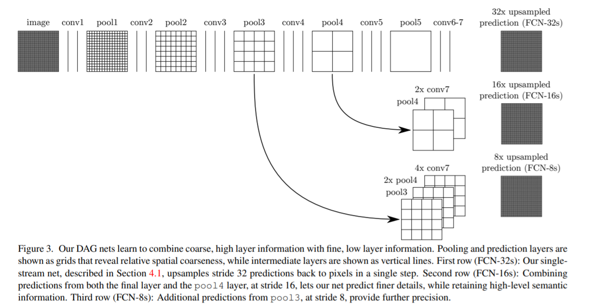
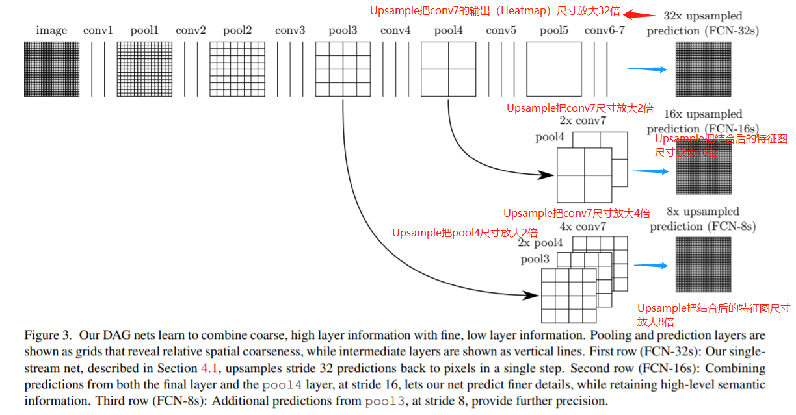
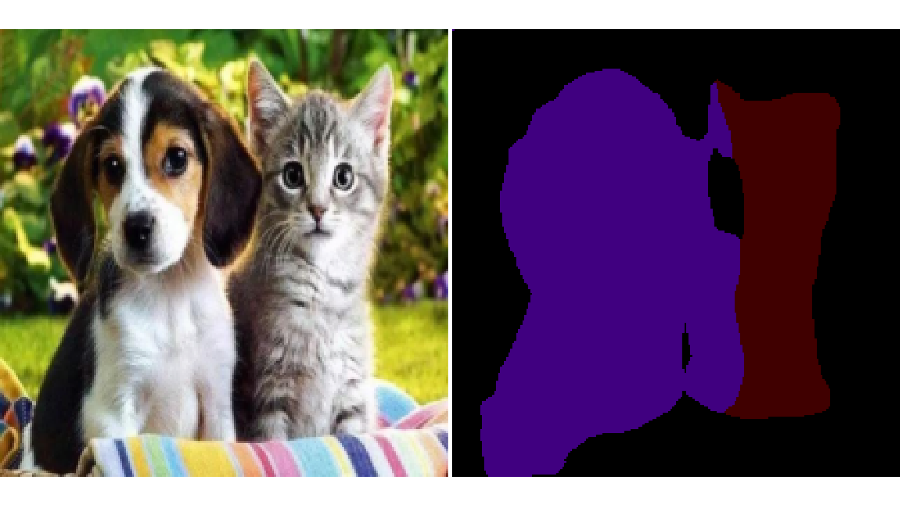

# FCN 

Paper: [Fully Convolutional Networks for Semantic Segmentation](https://openaccess.thecvf.com/content_cvpr_2015/papers/Long_Fully_Convolutional_Networks_2015_CVPR_paper.pdf)

## 1. 背景 (Backgrounds)
传统的基于CNN的语义分割方法是：将像素周围某一范围的区域（如25*25）作为CNN输入，进行训练和预测。这样做存在如下问题： 

- 像素区域的大小如何确定

- 存储及计算量非常大（相邻像素重复计算，使用滑动窗口给CNN判别分类，存储空间根据滑动窗口大小和次数上升）

- 像素区域的大小限制了感受野的大小，从而只能提取一些局部特征

CNN的优势：
```shell
（1）对于浅层卷积层，CNN感知区域较小，可以学到局部特征；
（2）更深的卷积层感受野更大，可以学习更多的抽象特征。但这些抽象特征虽然能很好地判断图像中所
包含的物体类别，但因为丢失了一些物体信息，不能较好地对物体的轮廓、像素进行具体的划分，所以实现精确的分割效果存在一定难度。
```


## 2. 核心思想 (Idea)
- 不含全连接层(fc)的全卷积(fully conv)网络，对图像像素级的分类，可适应任意尺寸输入；
  
  （图像分割需要的是一个分割图（二维甚至三维），而分类任务中的全连接层会使空间信息丢失，所以要将全连接层换成卷积层）

- 增大数据尺寸的反卷积(deconv)层，使输出精细的结果； 
  
- 结合不同深度层结果的跳级(skip)结构，提升鲁棒性和精确性。

采用反卷积层对最后几个卷积层的feature map进行上采样, 使它恢复到输入图像相同的尺寸，从而可以对每个像素都产生了一个预测, 同时保留了原始输入图像中的空间信息, 最后在上采样的特征图上进行逐像素分类。最后逐个像素计算softmax分类的损失, 相当于每一个像素对应一个训练样本。


注意：论文中把基于深度学习的分类网络中最后的一个具有空间信息的特征图称为Heatmap。

Upsample的实现方法有：（1）反maxpool；（2）Transpose2d Conv; (3) 双线性插值

## 3. 模型结构 (Model Instructure)

<div align="center">
 

Figure 1. Original FCN structure in the paper.
</div>

首先采用vgg16对原图像进行卷积conv1、pool1后原图像缩小为1/2；之后对图像进行第二次conv2、pool2后图像缩小为1/4；
接着继续对图像进行第三次卷积操作conv3、pool3缩小为原图像的1/8，此时保留pool3的featureMap；
然后继续对图像进行第四次卷积操作conv4、pool4，缩小为原图像的1/16，保留pool4的featureMap；
之后对图像进行第五次卷积操作conv5、pool5，缩小为原图像的1/32，
然后把原来CNN操作中的全连接变成卷积操作conv6、conv7，图像的featureMap数量改变但是图像大小依然为原图的1/32（得到的特征图称为HeatMap，并且这说明```原图必须是32的整数倍```）。

<div align="center">
 

Figure 2. FCN structure with remark.
</div>

## 4. 实验效果展示 (Experiment Results)
Train process code: 
```python
python train.py 
```
Eval process code: 
```python
python eval.py 
```
Predict a image code:
```python
python predict.py --img-path "test.jpg" --weight-path "./res_trained/mdoel_best.pth" --backbone "resnet50"
```
Predict some image from VOC2012 val dataset or batch data code (default use: resnet50):
```python
python predict_show.py --img-path "test.jpg" --weight-path "./res_trained/mdoel_best.pth" --backbone "resnet50"
```

|  backbone   | Size x Size |  Mean_IOU |
|  ---------  | ----------- | --------  |
|   ResNet50  |  224 x 224  |   55.2    |
|   ResNet101 |  224 x 224  |   58.0    |
|   VGG19     |  224 x 224  |   48.20   |
|   VGG16     |  224 x 224  |   43.1    |

<div align="center">
 

Figure 3. 实验效果展示.
</div>

## 5. 总结 (Conclusion)
不足：
- 得到的结果还不够精细。进行8倍上采样虽然比32倍的效果好了很多，但是上采样的结果还是比较模糊和平滑，对图像中的细节不敏感。
- 是对各个像素进行分类，没有充分考虑像素与像素之间的关系。忽略了在通常的基于像素分类的分割方法中使用的空间规整（spatial regularization）步骤，缺乏空间一致性。

基于深度学习的图像语义分割“通用框架”基本已经确定：前端 FCN（包含基于此改进的：SegNet、DeconvNet、DeepLab）+ 后端 CRF/MRF（条件随机场/马尔科夫随机场）优化。

## Reference
[1] https://blog.csdn.net/qinghuaci666/article/details/80863032

[2] https://openaccess.thecvf.com/content_cvpr_2015/papers/Long_Fully_Convolutional_Networks_2015_CVPR_paper.pdf
