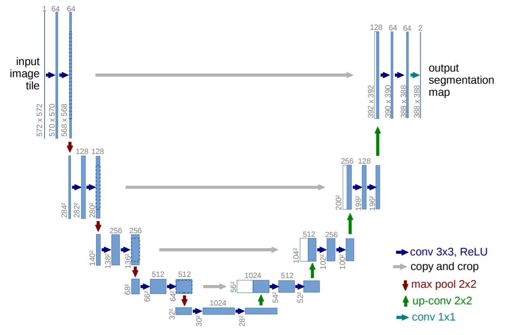

# U-Net
(U-Net: Convolutional Networks for Biomedical Image Segmentation)

[Paper](https://arxiv.org/pdf/1505.04597.pdf): https://arxiv.org/pdf/1505.04597.pdf

## 1. Train and Eval
- Dataset

   DRIVE dataset is used in the project as default dataset. We can download this dataset from [url](https://drive.grand-challenge.org/).
   
- Generally train for the dataset
```python
python train.py --data-path "xxx/xxx"  # "xxx/xxx" represents dataset root path such as "../dataset/"
```
- If you need use amp to accelerate and specify the path where the model is saved (such like ```"./checkpoints/"```):
```python
python train.py --amp --checkpoints "./checkpoints/"
```
## 2. Predict
use ```checkoints/best_model.pth``` to predict ```01_test.tif``` file and see rows 20-22 in ```predict.py``` file if you want to change.
```python
python predict.py
```
## 3. Model Instructure
<div align="center">
 

Figure 1. Original U-Net structure in the paper.
</div>

<div align="center">
 

Figure 2. modified U-Net structure for experiments.
</div>

## Reference
[1] https://github.com/WZMIAOMIAO/deep-learning-for-image-processing/tree/acac98bffe1b82719019951dcbbf0a49e555707b/pytorch_segmentation/unet

[2] https://github.com/milesial/Pytorch-UNet
